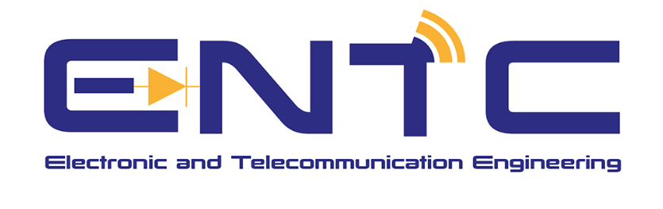
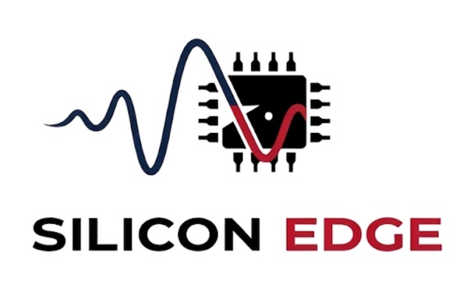

  
  
  
  
  

 

# Design Specification: Noise-Shaping (NS) SAR ADC

**Project:** TinyTapeout (Sky130)  
**Designer:** Silicon_Edge  
**Date:** March 2026

---

## 1. General Process & Architecture

| Parameter | Specification |
| :--- | :--- |
| **Process Technology** | Skywater 130nm (Sky130) |
| **Architecture** | 8-bit SAR Core with Noise Shaping (NS) |
| **Target Performance** | 10-bit ENOB (via Noise Shaping/OSR) |
| **Target Area** | 1x2 tiles (160x225µm) |

## 2. Voltage & Dynamic Range

| Parameter | Specification |
| :--- | :--- |
| **Supply Voltage (VDD)** | 1.8 V |
| **Reference Voltage** | 0.9 V / 1.0 V |
| **Common Mode Voltage** | 0.9 V |
| **Input Type** | Differential |
| **Input Voltage Range** | -0.9 V to +0.9 V (Differential Swing) |

## 3. Timing & Frequency

| Parameter | Specification |
| :--- | :--- |
| **Sampling Rate (fs)** | 1*(OSR) ksps |
| **Data Rate** | 1 ksps |
| **Application Profile** | Low-frequency Sensors |

## 4. Static & Dynamic Performance

| Parameter | Specification |
| :--- | :--- |
| **Differential Non-Linearity (DNL)** | ± 0.5 LSB |
| **Integral Non-Linearity (INL)** | ± 1.0 LSB |
| **Effective Number of Bits (ENOB)**| 10 bits (Targeted) |

## 5. Power Consumption

| Parameter | Specification |
| :--- | :--- |
| **Total Supply Current (IDD)** | 30 µA (Design Limit) |
| **Comparator Current Contribution**| 20 µA |

## 6. Physical Constraints

| Parameter | Specification |
| :--- | :--- |
| **Area Allocation** | 1x2 TinyTapeout Analog Tiles |
| **Layout Constraint** | Compatible with TT Digital Wrapper and Analog Pins |
| **PDK Compatibility** | sky130_fd_pr (Standard/MiM Cap) |
